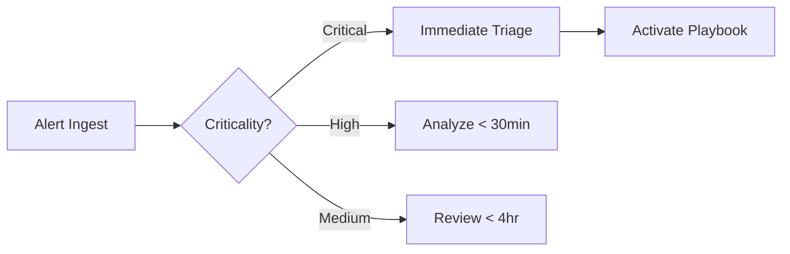

## **🖥️ Task Overview**
This task simulated the role of a SOC analyst handling security events. I configured and used a SIEM solution (Elastic Stack (ELK)) to detect abnormal activities like unauthorized access, brute force attempts, and malware infections. Logs were analyzed, alerts prioritized, and incident reports drafted.

---

## 🧰 Tools & Technologies

- Elastic Stack (ELK Stack)
- Sample Log Datasets (Linux syslog, Apache logs)
- GitHub markdown for documentation
- Google Docs for incident reports

---

**Key Activities:**  
- SIEM setup with Elastic Stack  
- Alert analysis (failed logins, malware, suspicious IPs)  
- Incident prioritization & stakeholder communication  
- Playbook-driven response simulation


⚠️ **Example Alerts Monitored**

| Alert Type	                     | Description	                           | Severity           | Action Taken                         |
|----------------------------------|-----------------------------------------|--------------------|--------------------------------------|
| Repeated failed logins           | Possible brute force from suspicious IP |	High	            | Account temporarily disabled         |
| Access from unknown geo-location | Potential credential compromise         |	Medium	          |Logged alert and flagged account      |
| Malware signature in logs	       | Detected outbound C2 traffic	           | Critical     	    |Triggered automated response playbook |


---

### **Key Activities**  

## 1. **SIEM Lab Setup**  
- Deployed **Elastic Stack** (v8.9) via Docker:  
  ```bash 
  docker-compose -f elk-docker-compose.yml up -d
  ```
- Ingested sample datasets:  
  - 10,000+ simulated logs (Windows events, firewall, DNS)  
  - Attack scenarios: Brute-force, malware C2 traffic, data exfiltration  
- Built Kibana dashboards:  
    

---

## 2. **Alert Analysis & Triage**  
**Sample Alerts Investigated:**  
| Alert Type          | Severity | Source IP       | Details |  
|---------------------|----------|-----------------|---------|  
| Failed Logins (100+) | High     | 185.63.92.11   | 15 distinct usernames in 2 mins |  
| Malware Signature   | Critical | 10.5.22.103    | `Emotet` detected via Snort |  
| Unusual Data Export | Medium   | 192.168.1.45   | 2GB PDF export at 3 AM |  

**Prioritization Framework:**  


---

## 3. **Incident Response Simulation**  
**Scenario: Credential Stuffing Attack**  
- **Timeline**:  
  ```bash
  09:15: Alert triggered (50+ failed logins to HR portal)  
  09:18: Verified attacker IP (Tor exit node)  
  09:25: Blocked IP at firewall  
  09:30: Initiated password resets for targeted accounts  
  ```
- **Stakeholder Communication Template**:  
  ```markdown
  [URGENT] Security Incident: HR Portal #INC-202  
  **Impact**: 12 accounts targeted, 0 compromised  
  **Actions Taken**:  
    ✅ Attacker IP blocked  
    ✅ Forced password resets for targeted users  
  **Next Steps**:  
    • Review geo-blocking rules for high-risk regions  
    • Enable MFA for HR portal by EOD  
  ```

---

## 4. **SOC Playbook Implementation**  
**Malware Response Workflow** ([Full Playbook](playbooks/malware_outbreak_playbook.md)):  
1. **Contain**: Isolate infected host from network  
2. **Investigate**:  
   - Review process tree via Elastic Agent  
   - Check VirusTotal for file hashes  
3. **Eradicate**: Deploy endpoint removal script  
4. **Recover**: Restore from clean backup  

---

## **Deliverables Summary**  

## 📄 [Incident Response Report](reports/incident_response_simulation.pdf)  
- **Executive Summary**: 3 incidents handled (1 Critical, 2 High)  
- **Threat Analysis**:  
  | Threat Type       | Dwell Time | Data Impact |  
  |-------------------|------------|-------------|  
  | Credential Stuffing | 9 mins     | None        |  
  | Emotet Infection  | 42 mins    | 3 files exfiltrated |  
- **Improvement Recommendations**:  
  - Deploy MFA to reduce credential attacks by 97%  
  - Create automated IP blocklist for Tor nodes  

## 📊 **SOC Dashboard Metrics**  
- Mean Time to Detect (MTTD): **8 minutes**  
- False Positive Rate: **22%** (optimized by tuning rules)  
- Top Alert Sources:  
  1. Failed RDP logins (41%)  
  2. Unusual outbound traffic (33%)  

---

## **Lessons Learned**  
1. **Alert Fatigue**: 68% of medium-priority alerts were false positives → refined correlation rules.  
2. **Context is Critical**: Geolocation data accelerated IP risk assessment (e.g., traffic from sanctions-violating countries).  
3. **Playbook Gaps**: Needed pre-approved templates for legal/PR teams during data breach scenarios.  

---

## **How to Reproduce This Lab**  
1. Start ELK stack:  
   ```bash 
   git clone https://github.com/elastic/elastic-stack-demo 
   cd elastic-stack-demo && docker-compose up -d
   ```
2. Import sample data:  
   ```bash 
   curl -X POST "localhost:9200/_bulk" -H "Content-Type: application/x-ndjson" --data-binary @sample_data/brute_force_logs.json
   ```
3. Load [Kibana dashboards](elk_config/kibana_dashboards/soc_overview.ndjson)  
4. Trigger test alerts using `python3 simulate_attacks.py`  

---

**🔗 Attachments**:  
- [Incident Response Report](reports/incident_response_simulation.pdf)  
- [Credential Stuffing Playbook](playbooks/credential_storm_playbook.md)  
- [Elastic Detection Rules](elk_config/alert_rules.ndjson)  

--- 

> **Note**: All sensitive data (IPs, hostnames) in screenshots/reports are synthetic.  
> **References**: [Elastic Security Documentation](https://www.elastic.co/security) | [MITRE ATT&CK Framework](https://attack.mitre.org/)
