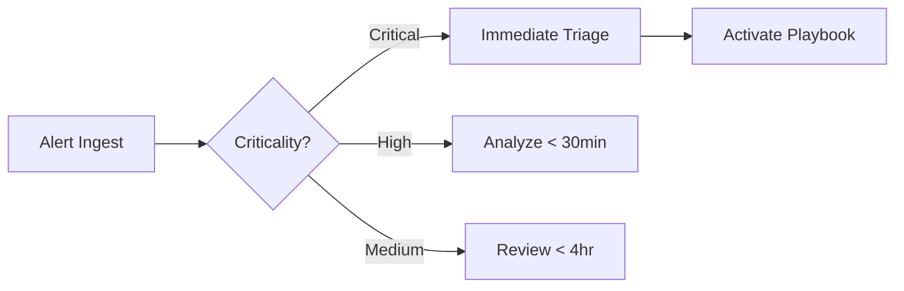

## **🖥️ Task Overview**
This task simulated the role of a SOC analyst handling security events. I configured and used a SIEM solution (Splunk) to detect abnormal activities like unauthorized access, brute force attempts, and malware infections. Logs were analyzed, alerts prioritized, and incident reports drafted.

---

## 🧰 Tools & Technologies

- Splunk
- Kali Linux
- Sample Log Datasets
- GitHub markdown for documentation
- MS Word for incident reports

---

**Key Activities:**  
- SIEM setup and Real-time log analysis with Splunk
- Alert analysis (failed logins, malware, suspicious IPs)  
- Detection of malware (Trojan, Rootkit)
- Connection attempt monitoring
- Alert severity classification

---

## 📌 Summary

Multiple malware alerts and repeated authentication failures were identified across several internal user accounts and IP addresses. Public IP addresses were involved in both login activity and malware detections, suggesting the possibility of remote compromise and lateral movement.

---

## 🧪 Key Findings

| Event Type            | Description                                          | Affected Users              | Impacted IPs           |
|-----------------------|------------------------------------------------------|-----------------------------|-------------------------|
| **Malware Detected**  | Various signatures including Trojan, Ransomware      | bob, alice, david, eve      | 198.51.100.42, 10.0.0.5 |
| **Login Failures**    | Repeated failures from external IPs                  | bob, alice, david, charlie  | 203.0.113.77, 198.51.100.42 |
| **Suspicious Access** | File access following malware detections             | bob, david, eve             | Mixed internal + external |

---

## ⚠️ Alerts & Prioritization

| Alert Type                     | Severity  | Justification                                              |
|--------------------------------|-----------|-------------------------------------------------------------|
| Trojan Detected (multi-user)   | High      | Widespread infection observed across internal users         |
| Ransomware Behavior            | Critical  | Flagged on user `bob`; potential data encryption detected   |
| Rootkit Signature              | High      | Advanced threat; observed on `eve`, `alice`                 |
| Login Failures from Public IP  | Medium    | Possible brute-force or credential stuffing attempt         |
| File Access Post-Infection     | Medium    | Indicates possible data exfiltration                        |

---

## 📈 Event Timeline

| Timestamp  | User    | IP Address     | Activity                        |
|------------|---------|----------------|---------------------------------|
| 04:18–04:41| alice   | Multiple       | Malware detection + file access |
| 05:06      | bob     | 203.0.113.77   | Worm Infection Attempt          |
| 06:21      | alice   | 203.0.113.77   | Login success after infection   |
| 07:45      | charlie | 172.16.0.3     | Trojan alert                    |
| 09:10      | bob     | 172.16.0.3     | Ransomware behavior             |

---

## 🧯 Incident Response Recommendations

### 🔒 Mitigation
- Isolate impacted systems immediately.
- Disable user accounts for `bob`, `alice`, `charlie`, `david`, and `eve`.
- Initiate malware scans and forensic review.

### 🔍 Investigation
- Correlate login timestamps with malware alert windows.
- Identify if infected users accessed sensitive resources or executed binaries.

### 🔐 Containment & Remediation
- Block suspicious public IPs: `203.0.113.77`, `198.51.100.42`
- Deploy network segmentation for vulnerable zones.
- Patch known exploits and review endpoint configurations.

---

## ✅ Next Steps
- Enable threat intelligence and geolocation enrichment in Splunk.
- Configure correlation searches for multi-stage attack detection.
- Build dashboards for real-time malware and login anomaly alerts.

---

**Prioritization Framework:**  

---

## **Incident Response Simulation** 🔥

**Scenario**:  
Over a 5-hour window on July 3rd, 2025, malware detections (Trojan, Rootkit, Ransomware) occurred across internal users and IPs. These alerts were paired with failed logins, suspicious external IP activity, and anomalous file access patterns—suggesting coordinated compromise attempts with possible lateral movement.

**Detected Activities**:
- Malware alerts from 5 user accounts
- Login failures from suspicious external IPs
- File access following infection
- Ransomware signatures on user `bob`

**Actions Taken**:
- User sessions isolated
- IP access blocked
- Alerts escalated and enriched
- Response report compiled and dashboard built for visibility

---

## **SOC Playbook Implementation** ⚙️

| Step                         | Action                                                                 |
|------------------------------|------------------------------------------------------------------------|
| **Detection**                | SPL searches flagged malware, failed logins, file access anomalies     |
| **Triage**                   | Categorized alerts by severity and user risk                           |
| **Investigation**            | Correlated events across time, user, and IPs to uncover attack vectors |
| **Containment**              | Suggested isolation of infected hosts and user accounts                |
| **Remediation**              | Malware scan initiated, user permissions revoked                       |
| **Recovery & Monitoring**    | Real-time dashboard deployed, external IP alerts configured            |
| **Documentation**            | Report filed (see below), queries saved, timeline logged               |

---

## 📊 **SOC Dashboard Metrics**

| Panel Title                    | Description                                     | Example Visualization  |
|-------------------------------|--------------------------------------------------|------------------------|
| Malware Alerts by Signature   | Counts of Trojan, Rootkit, etc. per user         | Bar Chart              |
| Failed Logins Heatmap         | Auth failure frequency per hour per user         | Heatmap                |
| External IP Access            | Attempts from flagged IPs                        | Table + Severity Tags  |
| Incident Timeline             | All alert types across time                      | Time Series Line Chart |
| Severity Breakdown            | Alert counts by High/Medium/Low classification   | Pie or Donut Chart     |

---

**🔗 Attachments**:  
- [Incident Response Report](https://github.com/deejonsen/FUTURE_CS/blob/main/Incident%20Response%20Report.md)
--- 

> **Note**: All sensitive data (IPs, hostnames) in screenshots/reports are synthetic.  
