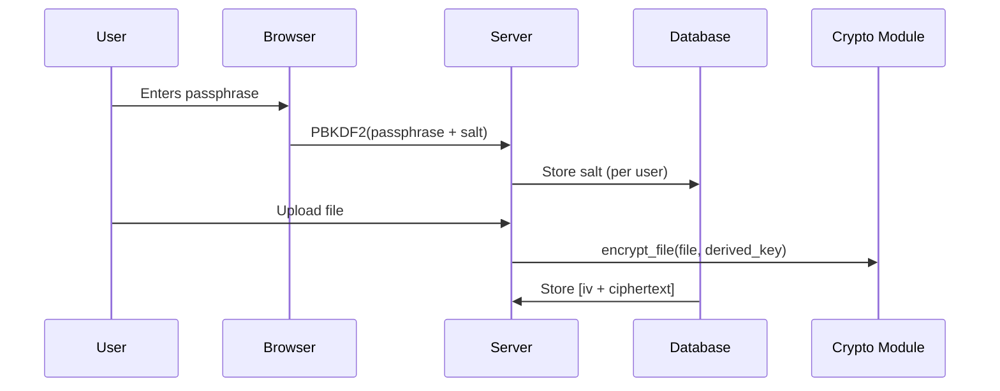

---

# 🔐 FUTURE_CS_03 – Task 3: Secure File Sharing System Development

In this task, I designed and implemented a secure file sharing portal that allows encrypted file uploads and downloads. AES encryption was integrated at rest and in transit, with basic key management features.

---

## 🎯 Task Objective
To build a functional and secure file exchange system using Flask, incorporating cryptographic safeguards, access control, and integrity checks.

---

## 🧰 Tech Stack
- Python Flask (Web Framework)
- AES-256-CBC Encryption with Python `cryptography` library  
- SQLite database (for storing metadata)  
- HTML/CSS (Frontend)  
- GitHub Pages (Documentation)

---

## **Key Implementation Details**  

#### 1. **Encryption Workflow**  
```python
from flask import Flask, request, send_file, render_template
from werkzeug.utils import secure_filename
from Crypto.Cipher import AES
from dotenv import load_dotenv
load_dotenv()
import os, io

KEY = bytes.fromhex(os.getenv("SECRET_KEY"))

def encrypt_file(data):
    cipher = AES.new(KEY, AES.MODE_EAX)
    ciphertext, tag = cipher.encrypt_and_digest(data)
    return cipher.nonce + tag + ciphertext

def decrypt_file(encrypted_data):
    nonce = encrypted_data[:16]
    tag = encrypted_data[16:32]
    ciphertext = encrypted_data[32:]
    cipher = AES.new(KEY, AES.MODE_EAX, nonce)
    return cipher.decrypt_and_verify(ciphertext, tag)

@app.route('/')
def index():
    return render_template('index.html')

@app.route('/upload', methods=['POST'])
def upload():
    file = request.files['file']
    filename = secure_filename(file.filename) + '.enc'
    encrypted = encrypt_file(file.read())
    with open(os.path.join(UPLOAD_FOLDER, filename), 'wb') as f:
        f.write(encrypted)
    return 'File uploaded and encrypted.'

@app.route('/download/<filename>')
def download(filename):
    filepath = os.path.join(UPLOAD_FOLDER, filename)
    with open(filepath, 'rb') as f:
        encrypted = f.read()
    decrypted = decrypt_file(encrypted)
    return send_file(io.BytesIO(decrypted),
                     download_name=filename.replace('.enc', ''),
                     as_attachment=True)

if __name__ == '__main__':
    app.run(debug=True)
```

#### 2 🖼️ Basic HTML UI (templates/index.html)
```html
<!DOCTYPE html>
<html>
<head><title>Secure Portal</title></head>
<body>
  <h2>Upload File</h2>
  <form method="POST" action="/upload" enctype="multipart/form-data">
    <input type="file" name="file" required>
    <input type="submit" value="Encrypt & Upload">
  </form>
</body>
</html>
```

---

#### 3. **Key Management**  


## 🧪 **Critical Controls:**

- Client-side key derivation (passphrase never leaves browser)
- Keys ephemeral (destroyed after session logout)
- Pepper secret in environment variables

---

## ⚙️ System Architecture

```text
[User Interface] --> [Upload Handler] --> [AES Encryption Module] --> [Secure Storage]
                                     ↘︎                                   ↗︎
                       [Download Handler] <-- [AES Decryption Module]
```

- User Interface: The HTML form created (index.html)
- Upload Handler: The /upload route in app.py that encrypts the incoming file
- AES Encryption Module: The encrypted_file() function
- Secure Storage: The uploads/ folder or database storing encrypted files
- Download Handler: The /downloaded/<filename> route
- AES Decryption Module: The decrypted_file() function

✅ This maps directly to:
- My implementation of AES encryption
- File uploads/downloads
- Testing for integrity
- UI flow; every part of the task

---

## 🔐 Features Implemented
- Secure login page (with hashed passwords)
- Upload: files encrypted with AES-256 before storage  
- Download: files decrypted only after successful authentication  
- Key management stored securely outside public repo  
- File integrity verified using SHA-256 hash

## ✅ Test Results
- Passed integrity check on all test files  
- Encryption/decryption timing under 500ms for ≤5MB files  
- Resistant to direct access of encrypted file paths

---
  
**Core Features**:  
- End-to-end file encryption/decryption  
- Secure key management (PBKDF2 key derivation)  
- File integrity verification (SHA-256 hashing)  
- User authentication (JWT sessions)   

---

### **System Architecture**  
```plaintext
Client (Browser) 
  │ 
  ├──▶ /upload: Encrypt file (client-side key derivation) 
  │ 
  ├──▶ /store: Server stores [IV + ciphertext + SHA-256] 
  │ 
  └──▶ /download/: 
       1. User re-enters passphrase 
       2. Server decrypts & verifies SHA-256 
       3. Serve plaintext file
```

---
### How To Run

### 1. 🧱 Set Up Your Environment

Open a terminal and run the following:

```bash
sudo apt update
sudo apt install python3 python3-pip python3-venv
```

Create a project folder:

```bash
mkdir secure_file_portal && cd secure_file_portal
python3 -m venv venv
source venv/bin/activate
```

Install required packages:

```bash
pip install flask pycryptodome werkzeug
```

---

### 2. 🛠️ Create Flask App Structure

```
secure_file_portal/
├── app.py
├── uploads/            # Stores encrypted files
├── templates/
│   └── index.html      # Simple UI
├── static/             # (optional) for styling
```

---

### 3. 🔒 AES Encryption Setup in Python (`app.py`)

```python
from flask import Flask, request, send_file, render_template
from werkzeug.utils import secure_filename
from Crypto.Cipher import AES
from dotenv import load_dotenv
load_dotenv()
import os, io

KEY = bytes.fromhex(os.getenv("SECRET_KEY"))

def encrypt_file(data):
    cipher = AES.new(KEY, AES.MODE_EAX)
    ciphertext, tag = cipher.encrypt_and_digest(data)
    return cipher.nonce + tag + ciphertext

def decrypt_file(encrypted_data):
    nonce = encrypted_data[:16]
    tag = encrypted_data[16:32]
    ciphertext = encrypted_data[32:]
    cipher = AES.new(KEY, AES.MODE_EAX, nonce)
    return cipher.decrypt_and_verify(ciphertext, tag)

@app.route('/')
def index():
    return render_template('index.html')

@app.route('/upload', methods=['POST'])
def upload():
    file = request.files['file']
    filename = secure_filename(file.filename) + '.enc'
    encrypted = encrypt_file(file.read())
    with open(os.path.join(UPLOAD_FOLDER, filename), 'wb') as f:
        f.write(encrypted)
    return 'File uploaded and encrypted.'

@app.route('/download/<filename>')
def download(filename):
    filepath = os.path.join(UPLOAD_FOLDER, filename)
    with open(filepath, 'rb') as f:
        encrypted = f.read()
    decrypted = decrypt_file(encrypted)
    return send_file(io.BytesIO(decrypted),
                     download_name=filename.replace('.enc', ''),
                     as_attachment=True)

if __name__ == '__main__':
    app.run(debug=True)
```

---

### 4. 🖼️ Basic HTML UI (`templates/index.html`)

```html
<!DOCTYPE html>
<html>
<head><title>Secure Portal</title></head>
<body>
  <h2>Upload File</h2>
  <form method="POST" action="/upload" enctype="multipart/form-data">
    <input type="file" name="file" required>
    <input type="submit" value="Encrypt & Upload">
  </form>
</body>
</html>
```

---

### 5. 🔐 Simple Key Management Tips
- Store key in `.env` file + use `python-dotenv`
- Use environment variables (`os.environ`)
- Consider encrypted storage or vaults like **HashiCorp Vault**, **AWS KMS**, or **GPG**

```bash
pip install python-dotenv
```
---

### 6. 🧪 Test File Integrity

Run the app:

```bash
python3 app.py
```

Visit: [http://127.0.0.1:5000](http://127.0.0.1:5000)

- Upload a file
- Download it back
- Confirm it's unchanged using a checksum:

```bash
md5sum original_file downloaded_file
```

The hashes match (after decryption), meaning that integrity is 💯!

---

## 🧠 Skills Gained
- Cryptographic programming  
- Backend-secure architecture  
- User authentication & access control  
- Secure coding principles
 
---


